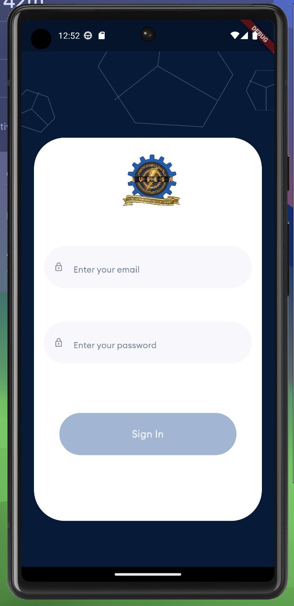
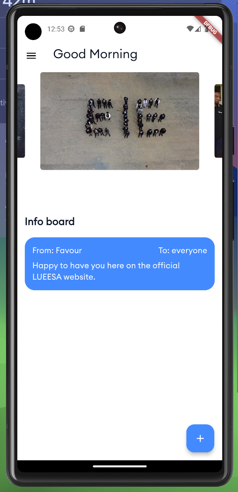
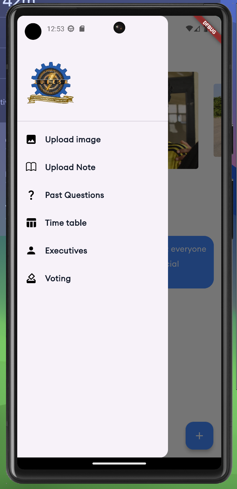
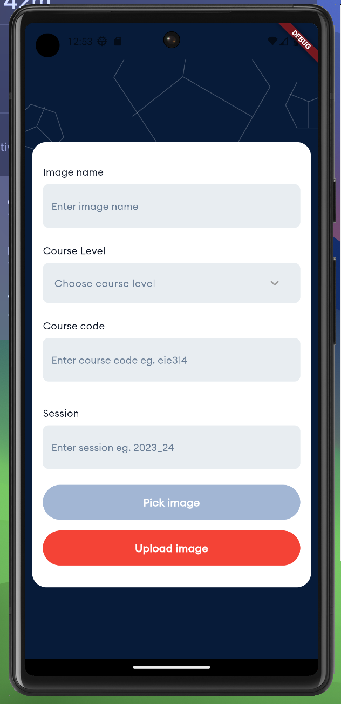
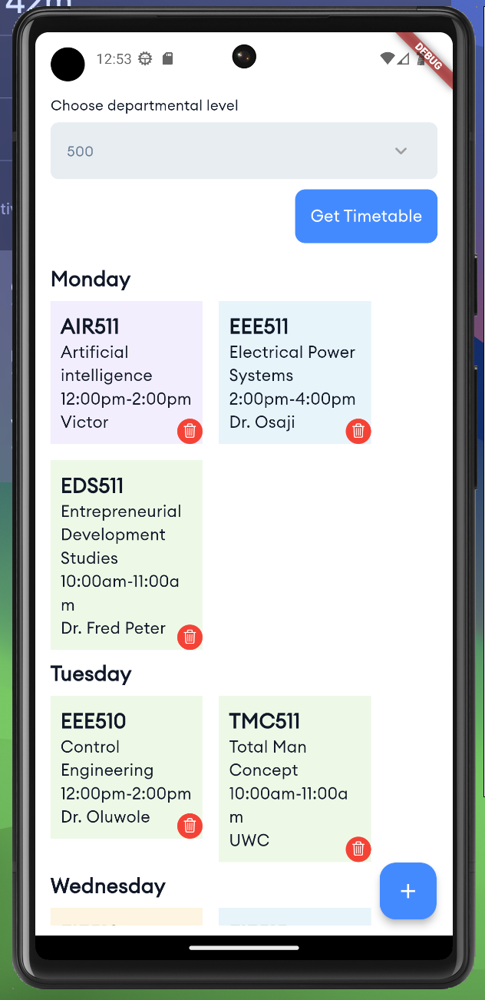

# LUEESA App

Welcome to the LUEESA App, a Mobile application designed for Electrical and Information Department. This app provides various features to help department members access important resources, stay updated with the department's activities, and participate in decision-making processes. Here are some few screenshots from the app.











## Features

### 1. View Past Questions and Notes

- Access past questions and notes relevant to your courses.
- Stay organized and prepared for exams with easy access to study materials.

### 2. Timetable

- View your department's timetable to stay informed about class schedules and events.
- Never miss a class or important departmental activity.

### 3. Upload Resources

- Contribute to the departmental repository by uploading past questions, notes, and other study materials.
- Share knowledge and help fellow department members excel academically.

### 4. Voting Feature

- Participate in the democratic process by voting for the next set of executives.
- Have a say in shaping the future of the department's leadership.

## Installation

To run the app on your device, follow these steps:

1. Clone the repository to your local machine:

   ```
   git clone <repository-url>
   ```

2. Navigate to the project directory:

   ```
   cd <project-directory>
   ```

3. Run the app on your device or emulator:

## Contributing

Contributions are welcome to improve and expand the functionality of the app. If you would like to contribute, please follow these steps:

1. Fork the repository to your GitHub account.

2. Create a new branch for your feature or bug fix:

   ```
   git checkout -b feature-name
   ```

3. Make your changes and commit them:

   ```
   git commit -m "Add feature or fix bug"
   ```

4. Push your changes to your fork:

   ```
   git push origin feature-name
   ```

5. Create a pull request from your fork's branch to the `main` branch of the original repository.

## Feedback

For feedback and suggestions to make the LUEESA App better. If you encounter any issues, have ideas for new features, or would like to share your thoughts, please [open an issue](https://github.com/emeleonufavour/lueesa_app/issues) on GitHub.
